# Lab 02 — Estrategia multiindicador en BTCUSDT (Nivel B)

**Equipo 4:** Andrea Santoyo · Isabela Torres 
Microestructura y Sistemas de Trading · ITESO

---

## 1. Resumen ejecutivo

Diseñamos una estrategia para BTCUSDT en velas de 5 minutos con tres indicadores calculados en velas de
4 horas (EMA, ROC y %B de Bollinger) y una regla de confirmación 2 de 3 con filtro de ADX. La señal se
calcula en t y se ejecuta en t+1, con comisión de 0.125% por lado. En el Nivel B agregamos un régimen
de mercado por reglas (crisis, tendencia y reversión a la media) que cambia los parámetros y cierra
posiciones al entrar a crisis. Optimizamos con un walk-forward de 73 ventanas y 29,200 configuraciones,
con el plan pre-registrado en git antes de ver resultados, y usamos el archivo de test una sola vez.

| Periodo | Curva | Retorno | Sharpe | Calmar | Máx. drawdown | Trades |
|---|---|---:|---:|---:|---:|---:|
| Walk-forward OOS (ago-2022 a dic-2023) | Con régimen | −33.7% | −1.91 | −0.75 | −34.9% | 162 |
| | Solo global | −9.7% | −0.48 | −0.33 | −21.6% | 137 |
| | Buy & hold | +84.5% | 1.31 | 1.50 | −37.9% | — |
| Test (mayo 2024) | Con régimen | +4.8% | 3.55* | 17.0* | −4.3% | 8 |
| | Solo global | +1.7% | 1.89* | 6.4* | −3.3% | 6 |
| | Buy & hold | +16.4% | 4.52* | 60.8* | −7.9% | — |

\* Anualizado desde un solo mes: se infla (ver sección 9).

**Conclusión:** no encontramos una ventaja real; lo que se veía en train era ajuste a la muestra
(sobreajuste), y fuera de muestra la estrategia queda muy por debajo del buy & hold.

## 2. Datos y decisiones

- **Archivos:** `data/btc_project_train.csv` (2022-06-01 a 2023-12-31) para todo el diseño, la
  optimización y la robustez; `data/btc_project_test.csv` solo para la evaluación final, del 2024-05-02
  al 2024-06-03.
- **Huecos:** el volumen falta en el **46.1%** de las barras (después de la limpieza), así que ningún
  indicador usa volumen. El archivo de test trae un día suelto (2023-12-31) y luego un hueco de 122 días.
- **Por qué 4 horas:** la comisión de ida y vuelta es 0.25%. En 5 minutos el ATR típico es mucho más
  chico que ese costo: cada operación arranca perdiendo. En 4 horas el movimiento ya es varias veces el
  costo. Las velas de 4h se arman con las de 5 min y una vela solo se usa cuando ya cerró (sin
  look-ahead); la ejecución y el stop se siguen midiendo en 5 min.

| Timeframe | ATR mediano en train | ATR / costo de ida y vuelta (0.25%) |
|---|---:|---:|
| 5 min | 0.079% | 0.3× |
| 1 hora | 0.51% | 2.0× |
| 4 horas | 1.21% | 4.8× |

## 3. Estrategia

**Tres votos** (cada uno vale +1, −1 o 0), de familias distintas:

| Voto | Familia | Regla |
|---|---|---|
| EMA | Tendencia | signo(EMArápida − EMAlenta) |
| ROC | Momento | signo(ROCn) |
| %B de Bollinger | Volatilidad | +1 si %B > u; −1 si %B < 1 − u; 0 si no |

**Regla 2 de 3.** Con Lt = número de votos +1 y St = número de votos −1:

> estadot = +1 si Lt ≥ 2 y ADXt > umbral 
> estadot = −1 si St ≥ 2 y ADXt > umbral 
> estadot = 0 en otro caso
>
> señalt = estadot si estadot ≠ estadot−1; 0 si no cambió

El ADX no vota: solo filtra la fuerza de la tendencia. Solo se entra cuando el estado cambia (si no,
se volvería a entrar en cada barra de la misma tendencia y se pagaría comisión cada vez). **La señal se
calcula al cierre de t y se ejecuta al open de t+1** (causalidad).

**Salidas:** stop-loss a `sl_mult · ATR(4h)`, take-profit a `rr · stop`, holding máximo y señal
contraria. Si en la misma vela se tocan el SL y el TP, se toma el **SL** (convención conservadora); si
el open ya cruzó el SL o el TP, se llena al open. **Tamaño:** se arriesga `rho` del capital por
operación (unidades = rho · capital / (sl_mult · ATR)), sin apalancamiento. **Comisión:** 0.125% por
lado, en cada apertura y cada cierre. Capital inicial de 1,000,000, largos y cortos.

**Parámetros finales (θ_final)**: mediana de los parámetros elegidos en las 73 ventanas del walk-forward.

| Estudio | EMA rápida / lenta | ROC | Bollinger | Umbral %B | Umbral ADX | sl_mult | rr | Holding máx. | rho |
|---|---|---:|---:|---:|---:|---:|---:|---:|---:|
| Global | 20 / 87 | 19 | 20 | 0.70 | 19.7 | 2.58 | 4.71 | 1656 | 1.2% |
| Crisis | 19 / 66 | 17 | 16 | 0.62 | 21.2 | 1.94 | 3.82 | 1680 | 1.2% |
| Tendencia | 17 / 61 | 13 | 16 | 0.66 | 19.8 | 2.30 | 4.76 | 1598 | 1.2% |
| Reversión | 19 / 76 | 27 | 25 | 0.75 | 19.9 | 2.59 | 4.80 | 2123 | 1.5% |

Las ventanas están en velas de 4h; el holding máximo está en barras de 5 min (1656 barras = 5.75 días).
Bollinger usa 2σ y ADX y ATR usan 14 velas. En palabras: con θ_final global la estrategia abre si al
menos 2 de 3 votan igual y ADX(14) > 19.7; vota sube con %B > 0.70 y baja con %B < 0.30; el stop
está a 2.6 × ATR y el take-profit a 4.7 veces el stop.

**Cómo elegimos los indicadores.** Partimos de la Act 05, donde buscamos indicadores de familias
distintas (tendencia, momento, volatilidad y volumen) revisando su correlación. El Chaikin Money Flow
(volumen) se cambió por Bollinger porque en BTC falta el volumen en casi la mitad de las barras. La
correlación que medimos después en BTC muestra que ROC y Bollinger votan casi igual (**0.67**), así
que la confirmación no es tan independiente como esperábamos (sección 8).

## 4. Motor de backtest

Motor event-driven (`src/backtest.py`) con estado explícito de **efectivo, posición y valor**: en cada
barra, valor = efectivo + unidades · Close (unidades negativas en un corto). En cada barra t el orden es:

1. **Open:** si el open ya cruzó el SL o el TP (gap), se cierra al open.
2. **Open:** si el régimen cambió a crisis en t−1, se cierra al open (regla R3).
3. **Open:** si la señal de t−1 es contraria a la posición, se cierra al open.
4. **Open:** si no hay posición y la señal de t−1 es ±1, se abre al open con el ATR de t−1.
5. **Intrabar:** SL y TP con el máximo y el mínimo de t (si se tocan los dos, gana el SL).
6. **Close:** si se cumplió el holding máximo, se cierra al cierre de t.

La comisión se cobra sobre el nocional **en cada apertura y en cada cierre**, y cada trade guarda la
comisión de entrada y de salida con el mismo monto que salió del efectivo.

**Pruebas obligatorias (PDF 3.7)**, todas pasan con `python -m pytest -q`:

1. Causalidad: `test_causality.py::test_signal_uses_only_past_data` (señal, estado y votos iguales con
   `df.iloc[:t+1]` y con la serie completa) y `test_backtest_uses_only_past_data`.
2. Confirmación: `test_confirmation.py::test_two_of_three_rule`, `test_low_adx_blocks_entry` y
   `test_signal_only_on_state_change`.
3. Contabilidad: `test_accounting.py::test_equity_is_cash_plus_units_times_close`,
   `test_commissions_match_formula` y `test_final_capital_is_initial_plus_gross_pnl_minus_commissions`.
4. Régimen: `test_regimes.py::test_regime_label_does_not_change_with_future_data` (reglas, K-means y
   HMM filtrado).

Además, el **golden test** (`test_backtest.py::test_golden_long_tp_then_short_tp`) compara el motor contra
un escenario calculado a mano barra por barra.

## 5. Optimización y walk-forward

- **Ventanas:** 73. Train de ~1 mes y test de la semana siguiente; las semanas de test avanzan 7 días
  sin traslape. El primer train empieza el 2022-07-01 (junio sirve de calentamiento).
- **Espacio de búsqueda:** `ema_fast` 5–30, `slow_ratio` 2–6, `roc_window` 6–42, `bb_window` 10–40,
  `bb_threshold` 0.55–0.90, `adx_threshold` 15–35, `sl_mult` 1–4, `rr` 1–8, `max_holding` 288–4032
  barras, `rho` 0.005–0.02.
- **Estudios:** 4 por ventana (global y uno por régimen) × 100 trials de Optuna: 30 aleatorios y luego
  TPE, con semilla 42 + número de ventana.
- **Objetivo:** Calmar del train. Un trial con menos de 5 operaciones (global) o 3 (régimen) es inválido.
- **Escala:** 29,200 configuraciones evaluadas en 64 segundos con 10 núcleos.
- **Pre-registro:** el plan (ventanas, objetivo, evaluación final y robustez) se escribió en
  `docs/SPEC.md` y se subió a git (`69caac8`) antes de correr el walk-forward; el código de la
  evaluación final se subió (`a20df90`) antes de su única corrida (`269e2fc`).

## 6. Detección de régimen

**Variables** en una ventana móvil de 1 semana, actualizadas **cada hora**: volatilidad anualizada,
trend_r2 (R² de una recta sobre el log-precio) y autocorrelación de 1 barra. **Reglas:** crisis si la
volatilidad pasa del percentil 90; si no, tendencia si trend_r2 > 0.5; si no, reversión a la media. El
umbral se ajusta con ventana expansiva (solo datos pasados).

| Método | Periodo | Duración media (h) | Transiciones/mes | Silhouette | % crisis | % tendencia | % reversión |
|---|---|---:|---:|---:|---:|---:|---:|
| Reglas | ajuste | 89.8 | 7.9 | 0.31 | 10.0 | 36.9 | 53.1 |
| Reglas | fuera de muestra | 101.0 | 7.0 | 0.37 | 3.0 | 31.4 | 65.6 |
| K-means | ajuste | 88.8 | 8.0 | 0.32 | 28.5 | 35.1 | 36.4 |
| K-means | fuera de muestra | 95.7 | 7.4 | 0.21 | 70.4 | 13.0 | 16.6 |
| HMM | ajuste | 102.5 | 6.9 | 0.31 | 26.3 | 40.9 | 32.8 |
| HMM | fuera de muestra | 175.9 | 4.0 | 0.20 | 82.5 | 9.4 | 8.1 |

**Por qué reglas.** Los tres métodos duran más de 12 h por régimen, pero fuera de muestra K-means y el HMM
(con probabilidades filtradas, que solo usan el pasado; Viterbi usa el futuro y queda solo como
comparación) llaman crisis al 70–82% del tiempo. Los centroides lo explican: fuera de muestra la
volatilidad de su "crisis" (0.39 en K-means y 0.37 en el HMM) ya es casi igual o menor que la de
tendencia (0.34 y 0.40), mientras que con reglas crisis sigue siendo lo más volátil (0.72 contra 0.37).
Las duraciones esperadas del HMM son 414.7 h (crisis), 90.5 h (tendencia) y 77.5 h (reversión).
Ningún método llega a silhouette > 0.4: BTC cambia de régimen de forma gradual.

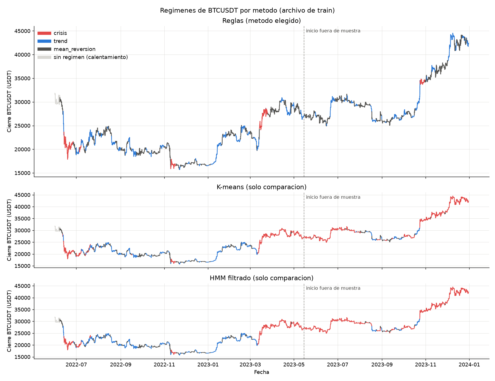
**Figura 1.** Precio de cierre coloreado por régimen: reglas (arriba), K-means y HMM filtrado.

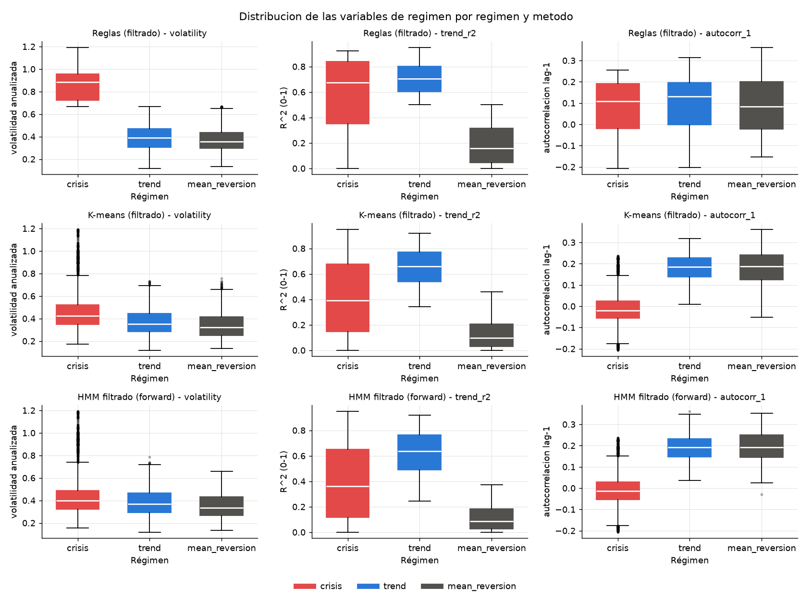
**Figura 2.** Volatilidad, trend_r2 y autocorrelación por régimen y método.

**Reglas de transición.** R1: una posición conserva el SL, TP y holding con los que entró. R2: las
entradas nuevas usan los parámetros del régimen en la barra de señal (t) y se ejecutan en t+1. R3: si el
régimen cambia a crisis, la posición se cierra al open siguiente. R4: entre tendencia y reversión la
posición sigue hasta su SL, TP, holding o señal contraria. R5: un régimen sin el mínimo de operaciones
en una ventana usa los parámetros globales de esa ventana.

| Régimen | Entradas al régimen por mes (OOS) | Cierres por R3 | Ventanas con R5 | % del tiempo en train | % en test |
|---|---:|---:|---:|---:|---:|
| Crisis | 0.24 | 0 | 59 | 10.0 | 22.2 |
| Tendencia | 3.29 | 1 | 0 | 33.0 | 30.0 |
| Reversión | 3.35 | 0 | 0 | 57.0 | 47.8 |
| Total | 6.88 | 1 | 59 | | |

En test hay más del doble de crisis; parte puede venir del hueco de 122 días (sección 11).

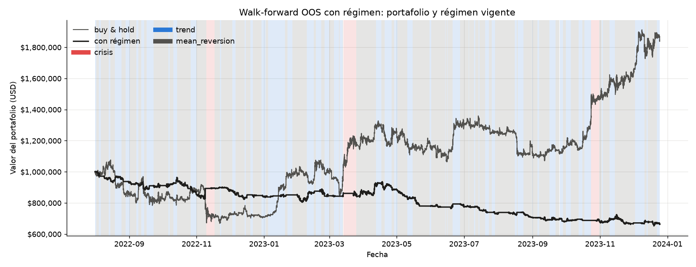
**Figura 3.** Curva OOS con régimen y buy & hold, con el régimen vigente de fondo.

## 7. Resultados

**Fuera de muestra (walk-forward, 2022-08-01 a 2023-12-25)** y **dentro de muestra** (θ_final global
sobre todo el archivo de train: θ_final salió de estos mismos datos):

| Métrica | OOS con régimen | OOS solo global | OOS buy & hold | Train θ_final (dentro de muestra) | Train buy & hold |
|---|---:|---:|---:|---:|---:|
| Retorno total | −33.7% | −9.7% | +84.5% | −10.6% | +32.6% |
| Sharpe | −1.91 | −0.48 | 1.31 | −0.47 | 0.64 |
| Sortino | −2.67 | −0.73 | 1.87 | −0.67 | 0.92 |
| Calmar | −0.75 | −0.33 | 1.50 | −0.33 | 0.39 |
| Máx. drawdown | −34.9% | −21.6% | −37.9% | −21.0% | −51.1% |
| Win rate | 25.9% | 30.7% | — | 23.5% | — |
| Trades | 162 | 137 | — | 170 | — |

**Retornos OOS mensuales:**

| Mes | Con régimen | Solo global | Buy & hold |
|---|---:|---:|---:|
| ago-2022 | −6.9% | +0.7% | −14.0% |
| sep-2022 | −2.1% | −2.1% | −3.1% |
| oct-2022 | −6.4% | −2.4% | +5.5% |
| nov-2022 | +3.7% | +1.0% | −16.3% |
| dic-2022 | −4.9% | +0.3% | −3.5% |
| ene-2023 | −0.4% | −2.8% | +39.8% |
| feb-2023 | +1.0% | +1.9% | +0.1% |
| mar-2023 | +3.1% | −2.1% | +23.0% |
| abr-2023 | +1.6% | −0.5% | +2.8% |
| may-2023 | −12.1% | −5.6% | −7.0% |
| jun-2023 | −0.5% | −5.0% | +11.7% |
| jul-2023 | −5.3% | +0.3% | −4.0% |
| ago-2023 | −3.9% | +2.0% | −11.3% |
| sep-2023 | −3.2% | −4.1% | +4.5% |
| oct-2023 | −0.9% | +12.5% | +28.0% |
| nov-2023 | −1.6% | +2.1% | +8.8% |
| dic-2023 | −0.4% | −5.0% | +14.1% |

**Retornos OOS trimestrales y anuales:**

| Periodo | Con régimen | Solo global | Buy & hold |
|---|---:|---:|---:|
| 2022 T3 (desde agosto) | −8.9% | −1.5% | −16.7% |
| 2022 T4 | −7.7% | −1.2% | −14.8% |
| 2023 T1 | +3.7% | −3.0% | +72.1% |
| 2023 T2 | −11.2% | −10.7% | +6.9% |
| 2023 T3 | −11.9% | −1.8% | −11.0% |
| 2023 T4 | −2.8% | +9.0% | +58.9% |
| **2022 (desde agosto)** | **−15.9%** | **−2.6%** | **−29.0%** |
| **2023** | **−21.1%** | **−7.3%** | **+160.0%** |

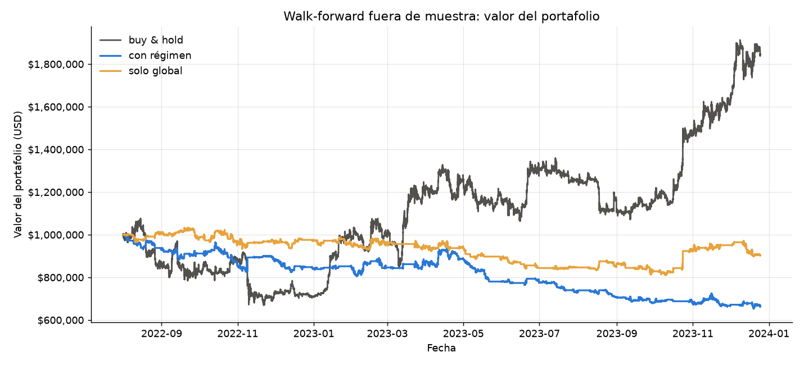 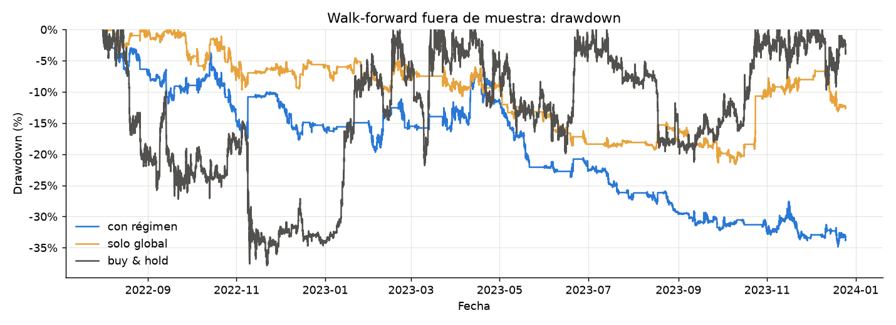
**Figura 4.** Valor del portafolio fuera de muestra: con régimen, solo global y buy & hold.
**Figura 5.** Drawdown fuera de muestra de las tres curvas.

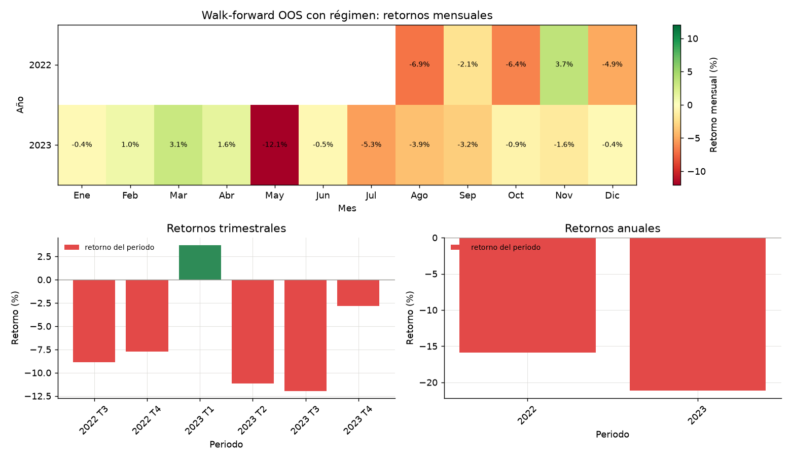
**Figura 6.** Retornos mensuales (heatmap), trimestrales y anuales de la curva OOS con régimen.

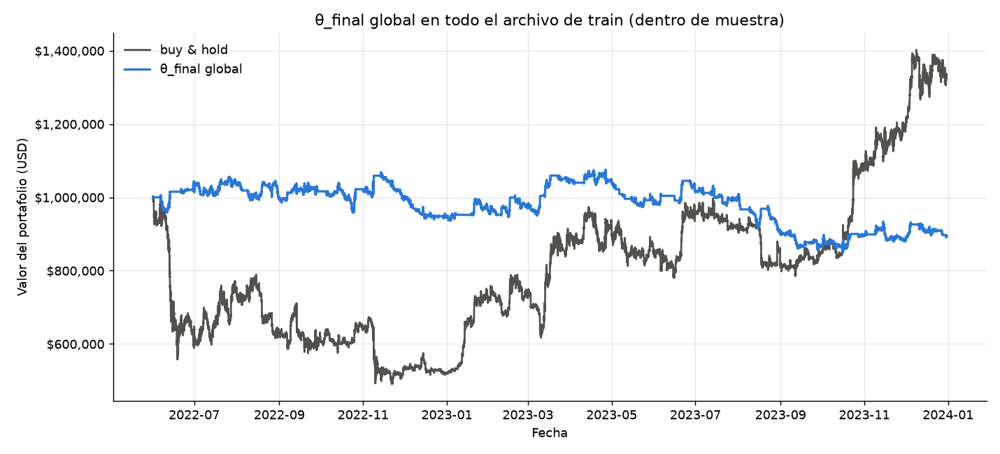
**Figura 7.** θ_final global en todo el archivo de train contra buy & hold (dentro de muestra).

## 8. Robustez (pre-registrada)

**Sensibilidad ±20%** de θ_final global (Calmar en todo train, uno a la vez):

| Parámetro | −20% | base | +20% | Calmar −20% | Calmar base | Calmar +20% |
|---|---:|---:|---:|---:|---:|---:|
| ema_fast | 16 | 20 | 24 | −0.33 | −0.33 | −0.32 |
| slow_ratio | 3.49 | 4.36 | 5.24 | −0.33 | −0.33 | −0.34 |
| roc_window | 15 | 19 | 23 | 0.14 | −0.33 | −0.25 |
| bb_window | 16 | 20 | 24 | −0.33 | −0.33 | 0.03 |
| bb_threshold | 0.56 | 0.70 | 0.84 | −0.40 | −0.33 | 0.28 |
| adx_threshold | 15.7 | 19.7 | 23.6 | −0.24 | −0.33 | 0.47 |
| sl_mult | 2.07 | 2.58 | 3.10 | −0.44 | −0.33 | −0.03 |
| rr | 3.77 | 4.71 | 5.65 | −0.44 | −0.33 | −0.15 |
| max_holding | 1325 | 1656 | 1987 | −0.38 | −0.33 | −0.33 |
| rho | 0.0095 | 0.0119 | 0.0142 | −0.31 | −0.33 | −0.35 |

**Es un pico, no una meseta:** mover un solo parámetro 20% cambia el signo del resultado (umbral del
ADX +20%: de −0.33 a +0.47; umbral de Bollinger +20%: a +0.28).

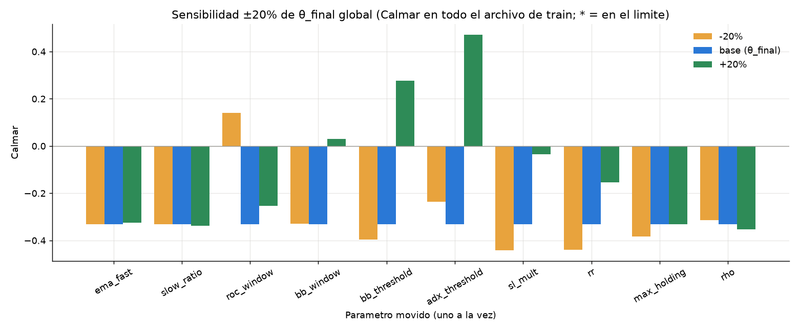
**Figura 8.** Calmar con cada parámetro en −20%, base y +20%.

**Costos de transacción** (mismas entradas por barra de la curva OOS; solo cambia la comisión):
la versión solo global gana +8.7% sin comisión y su **break-even es 5.6 pb por lado**; la comisión real
es 12.5 pb, así que el margen es **−6.9 pb**. Con régimen pierde incluso sin comisiones (−16.4%).

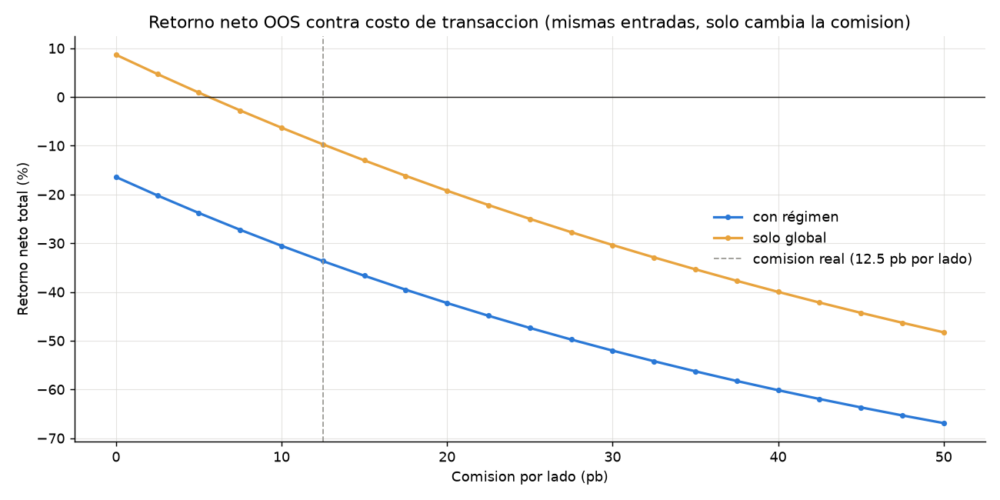
**Figura 9.** Retorno neto OOS contra comisión por lado, con la comisión real marcada.

**Un indicador contra 2 de 3** (θ_final en todo train):

| Regla | Trades | Calmar |
|---|---:|---:|
| 2 de 3 | 170 | −0.33 |
| ROC sola | 232 | −0.08 |
| Bollinger sola | 162 | −0.23 |
| EMA sola | 78 | −0.43 |

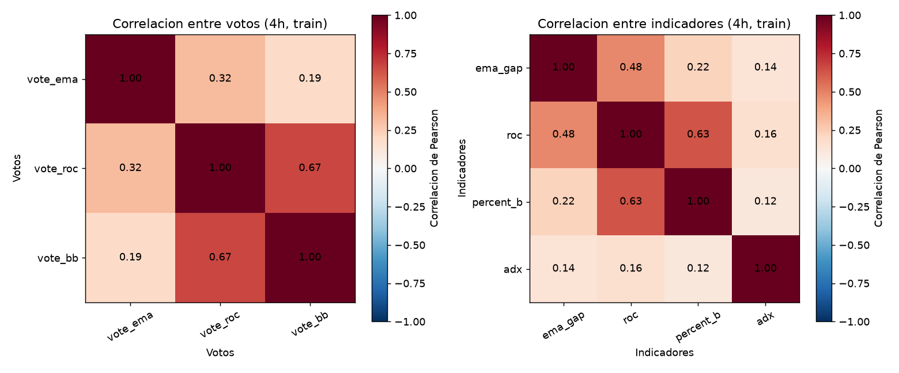
**Figura 10.** Correlación de los votos y de los indicadores en velas de 4h (train).

**Por régimen de entrada** (trades OOS con régimen; retorno por trade sobre el nocional; IC bootstrap
95% con 10,000 remuestreos y semilla 42). Kruskal-Wallis: **H = 10.35, p = 0.006**.

| Régimen | Trades | Win rate | Retorno por trade | IC 95% |
|---|---:|---:|---:|---|
| Reversión a la media | 98 | 20% | −0.79% | [−1.33%, −0.16%] |
| Tendencia | 58 | 33% | −0.10% | [−0.66%, +0.50%] |
| Crisis | 6 | 50% | +0.38% | [−1.10%, +2.27%] |

**Diagnóstico de las pérdidas:**

| | Con régimen | Solo global |
|---|---:|---:|
| PnL bruto (antes de comisiones) | −$146k | +$72k |
| Comisiones | $189k | $171k |
| PnL neto | −$336k | −$99k |
| Payoff (ganancia prom. / pérdida prom.) | 1.74 | 1.93 |
| Win rate de break-even = 1/(1+payoff) | 36.5% | 34.1% |
| Win rate real | 25.9% | 30.7% |

Por motivo de salida (con régimen), el stop-loss pierde −$586k en 54 trades y la señal contraria −$185k
en 70 trades con 15.7% de aciertos; el take-profit (+$293k en 15) y el holding máximo (+$124k en 22) no
alcanzan. Largos: 83 trades y −$239k; cortos: 79 trades y −$97k.

## 9. Evaluación final en test

Se corrió una sola vez con θ_final, el umbral de régimen ajustado con todo train e indicadores
calculados sobre train y test pegados (solo usan el pasado); solo cuentan las operaciones del
2024-05-02 al 2024-06-03.

| | Con régimen | Solo global | Buy & hold |
|---|---:|---:|---:|
| Retorno del periodo | +4.8% | +1.7% | +16.4% |
| Sharpe anualizado | 3.55 | 1.89 | 4.52 |
| **Sharpe mensual** (= anual / √12) | **1.03** | **0.55** | **1.30** |
| Sortino anualizado | 5.28 | 2.77 | 6.59 |
| Calmar anualizado | 17.0 | 6.4 | 60.8 |
| **Retorno / máx. drawdown** (sin anualizar) | **1.13** | **0.50** | **2.08** |
| Máx. drawdown | −4.3% | −3.3% | −7.9% |
| Win rate | 50% | 33% | — |
| Trades | 8 | 6 | — |

**Cómo leerla.** Anualizar un mes infla las métricas (el Sharpe anual es el mensual × √12 y el Calmar
compone un mes bueno doce veces). El Sharpe de 3.55 no es un error: viene del periodo, que fue muy bueno
para BTC (el buy & hold da 4.52 en el mismo mes). Con 1 mes y 8 trades no se puede concluir que haya
ventaja, y el resultado no contradice el walk-forward de 17 meses.

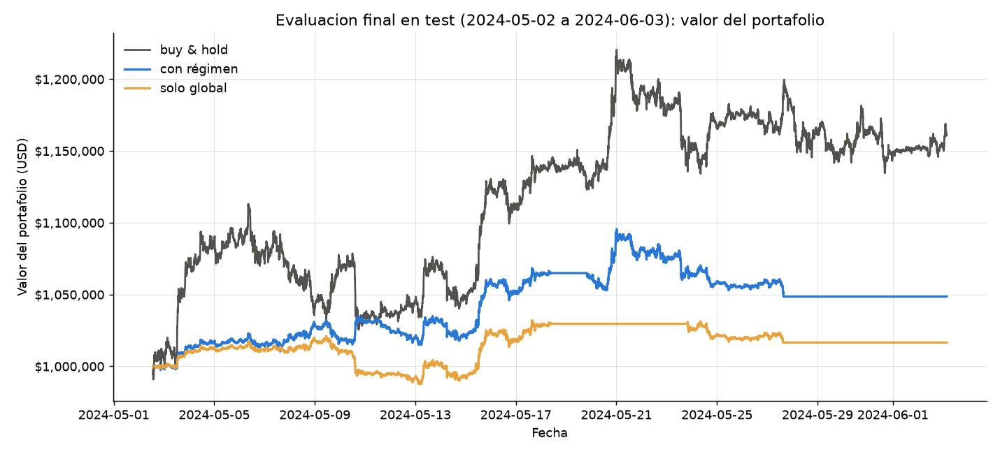 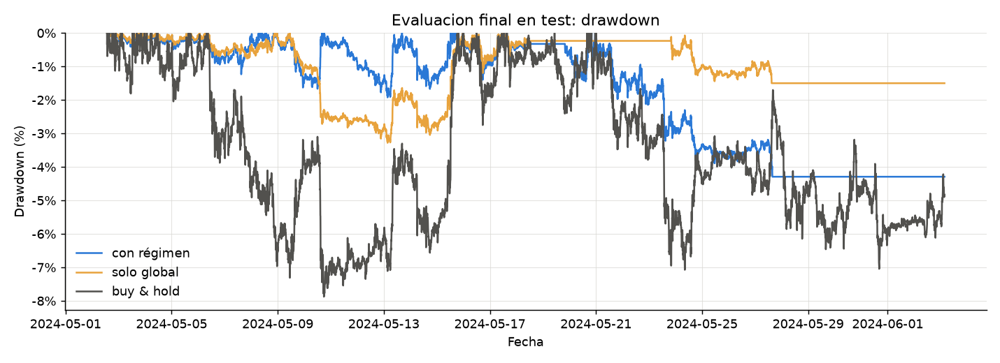
**Figura 11.** Valor del portafolio en test (2024-05-02 a 2024-06-03).
**Figura 12.** Drawdown en test.

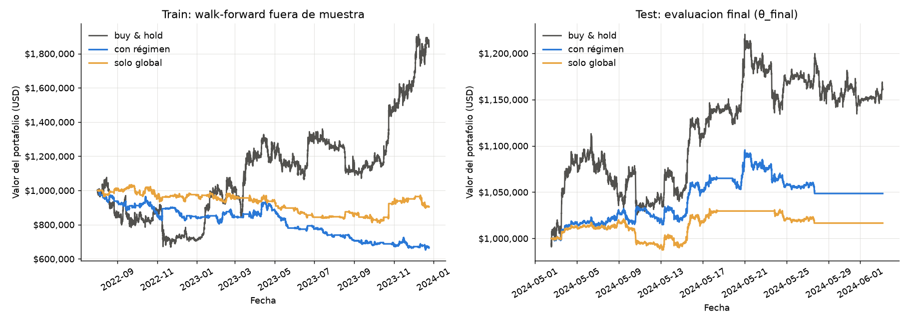
**Figura 13.** Walk-forward fuera de muestra (izquierda) y evaluación final en test (derecha).

## 10. Respuestas a las preguntas del PDF

**1. ¿La regla 2 de 3 mejora a un solo indicador?** No. Las cuatro reglas pierden y la 2 de 3 (170 trades,
Calmar −0.33) queda peor que ROC sola (232 trades, −0.08). ROC y Bollinger votan casi igual (0.67), así
que "2 de 3" casi siempre es "ROC y Bollinger de acuerdo": la confirmación no es independiente.

**2. ¿Cuánto de la ventaja de train sobrevive fuera de muestra?** Nada. En la misma escala, el mejor
trial gana +1.76% por semana en train y la curva OOS pierde −0.53% por semana con régimen y −0.12% solo
global. El Calmar de train (mediana 54.4) no se compara directo: se anualiza desde un mes.

**3. ¿Meseta o pico?** Pico. Con el umbral del ADX +20% el Calmar pasa de −0.33 a +0.47 y con el de
Bollinger a +0.28; con `sl_mult` o `rr` −20% baja a −0.44. Los parámetros no son estables.

**4. ¿Cuál es el break-even de costos?** 5.6 pb por lado para la versión solo global, contra 12.5 pb
reales (margen −6.9 pb). Con régimen no tiene break-even: pierde −16.4% sin comisiones.

**5. ¿El desempeño difiere entre regímenes?** Sí: Kruskal-Wallis da p = 0.006. La estrategia de
tendencia pierde en reversión a la media (−0.79% por trade, IC [−1.33%, −0.16%]). Pero optimizar por
régimen empeoró el resultado (−33.7% contra −9.7%): R3 solo cerró 1 trade y en crisis se usaron los
parámetros globales en 59 de 73 ventanas, así que la diferencia viene de más ajuste a la muestra.

**7. ¿Se podría ejecutar?** Con un nocional promedio de $468k (con régimen) a $498k (solo global) por
trade, cada orden es el 2.2–2.4% del volumen mediano de una barra de 5 min. El impacto estimado es de
~2 pb por lado, más de un tercio del break-even (sección 11).

## 11. Limitaciones

**Para operar con capital real:**

1. **Costos.** La comisión real (12.5 pb por lado) es más del doble del break-even (5.6 pb), y el
   impacto de mercado suma ~2 pb más por lado.
2. **Parámetros inestables.** La sensibilidad muestra un pico, no una meseta, y la ventaja de train no
   sobrevive fuera de muestra.
3. **Ejecución idealizada.** Llenado completo al open, sin latencia, slippage 0 y sin costo de
   financiamiento de los cortos (funding de perpetuos o préstamo).

**Advertencia de ejecución e impacto de mercado.** Con un modelo de raíz cuadrada,
impacto ≈ σ5min · √(nocional / volumen5min):

| Curva | Nocional promedio | Volumen mediano 5 min | Participación 5 min | Participación 4h | Impacto | % del break-even |
|---|---:|---:|---:|---:|---:|---:|
| Con régimen | $468k | $21.2M | 2.2% | 0.07% | 2.0 pb | 36% |
| Solo global | $498k | $21.2M | 2.4% | 0.07% | 2.1 pb | 37% |

σ5min = 0.136%; volumen mediano de una vela de 4h: $699M. Es solo un orden de magnitud: el
volumen de Yahoo es agregado y falta en el 46.1% de las barras. Ejecutar al open de la barra siguiente
no garantiza ese precio con órdenes de este tamaño.

**Limitaciones de los datos:**

- El volumen falta en el 46.1% de las barras (después de la limpieza).
- El archivo de test trae un día suelto (2023-12-31) y luego un hueco de 122 días: indicadores y
  regímenes cuentan barras, no tiempo, así que la primera semana de mayo 2024 todavía mezcla barras de
  diciembre de 2023. Es causal, pero mezcla dos épocas.
- La primera ventana del walk-forward solo tiene 30 días de calentamiento.
- Con 1 mes de train hay pocas señales: los mínimos de trades (5 global, 3 por régimen) son bajos.

## 12. Conclusiones

No encontramos una ventaja real. Con 29,200 configuraciones el optimizador siempre encuentra algo que
gana en cada mes de train (+1.76% por semana), pero fuera de muestra esa ventaja desaparece: la curva
continua de 17 meses pierde −33.7% con régimen y −9.7% solo global, contra +84.5% del buy & hold. La
sensibilidad muestra un pico, la regla 2 de 3 no mejora a ROC sola, la capa de régimen empeora el
resultado y aun la versión que gana antes de costos tiene un break-even de 5.6 pb, menos de la mitad de
la comisión real. El mes positivo de test (+4.8%, 8 trades, contra +16.4% del buy & hold) no cambia esta
conclusión. Lo que sí deja el trabajo es el método: walk-forward, pre-registro en git y un archivo de
test usado una sola vez, que es lo que nos permitió ver el sobreajuste en lugar de reportarlo como ventaja.

## 13. Reproducibilidad y uso de IA

**Reproducir:** `pip install -r requirements.txt` y luego `python main.py` (solo el walk-forward tarda 64
segundos con 10 núcleos). Genera todas las tablas en `docs/tables/` y las figuras en `docs/figures/`; el análisis está
en `notebooks/analysis.ipynb`. Pruebas: `python -m pytest -q`.

**Semillas:** `SEED = 42` en `src/optimize.py` (TPESampler de Optuna, semilla 42 + número de ventana),
`SEED = 42` en `src/regimes.py` (K-means) y `HMM_SEEDS = range(10)` en `src/regimes.py` (HMM).

**Uso de herramientas de IA.** Usamos Claude (Anthropic) en dos formas:

- **Claude Code**, para escribir código y pruebas bajo nuestras instrucciones: los módulos de `src/`
  (señal, motor de backtest, métricas, regímenes, optimización y walk-forward, gráficas), `main.py`,
  las pruebas de `tests/` y el armado del notebook.
- **Claude**, para planear cada paso, revisar los planes antes de ejecutarlos y revisar los resultados.
  También ayudó a redactar la documentación (`docs/SPEC.md`, el README, el texto del notebook y este
  reporte).

Todas las decisiones de diseño las tomamos nosotras: la estrategia y sus indicadores, la regla 2 de 3,
las reglas de transición entre regímenes y el pre-registro de los análisis antes de correrlos.
Revisamos cada cambio antes de hacer commit, y las dos podemos explicar cualquier línea del código.
